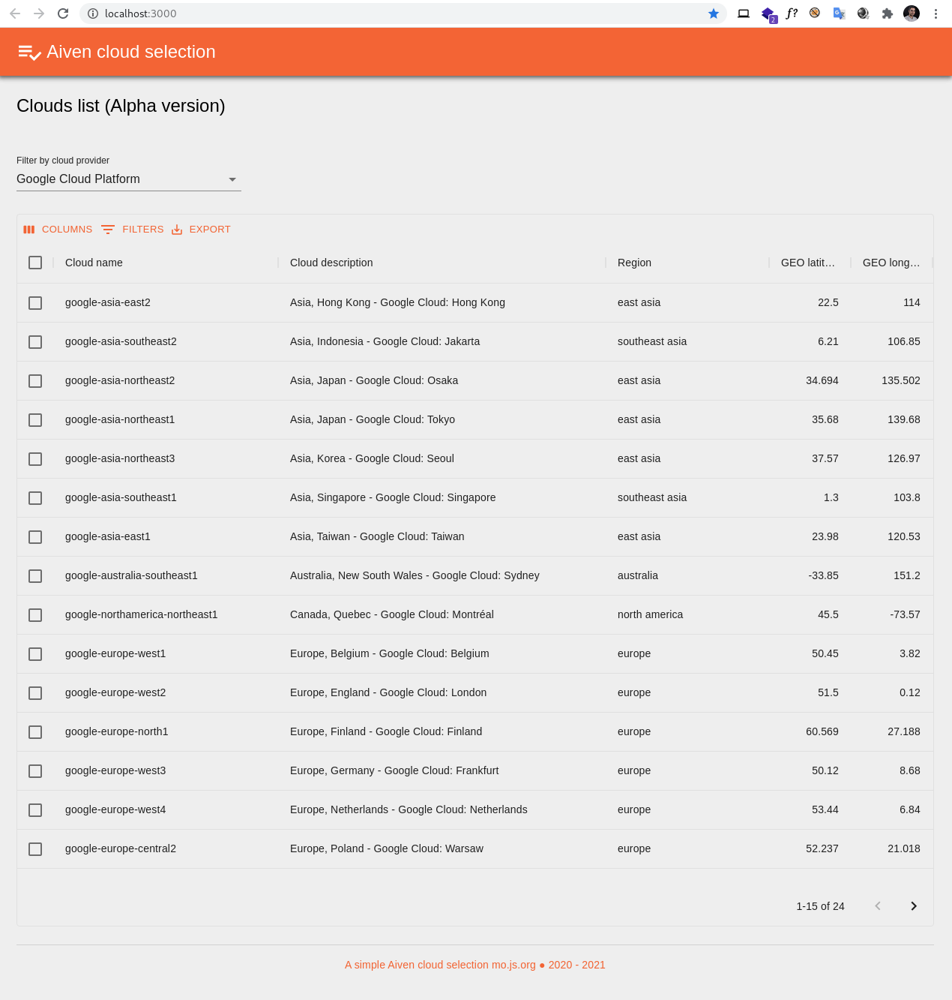

# Aiven cloud selection 

A simple project for Aiven cloud selection  

## How to use:

You must rename `.env.sample` to `.env` then set **base url** in the file\
_* The .env file is existed in the version for run easily :wink:_

### `yarn start`

Runs the app in the development mode.\
Open [http://localhost:3000](http://localhost:3000) to view it in the browser.

### `yarn test`

Launches the test runner in the interactive watch mode.

### `yarn build`

Builds the app for production to the `build` folder.

## Screenshot

## TODO:

- [x] Structure of project by react
- [x] Manage routes
- [x] UI by material-ui
- [x] Home page
- [x] Cloud page
- [x] Loading
- [x] Feature simple filter and sort by data-grid
- [x] Feature export csv by data-grid
- [x] Feature filter by cloud provider
- [ ] Feature filter distance (Geolocation)
- [ ] State manager by Redux
- [ ] Redux middleware by Redux Thunk
- [ ] Document by Storybook
- [ ] Unit test by Jest
- [ ] E2E test by Cypress
- [x] CI/CD
- [ ] Configure .env base on environment
- [ ] OPTIMIZE code

## References:

- https://reactjs.org/
- https://material-ui.com/
